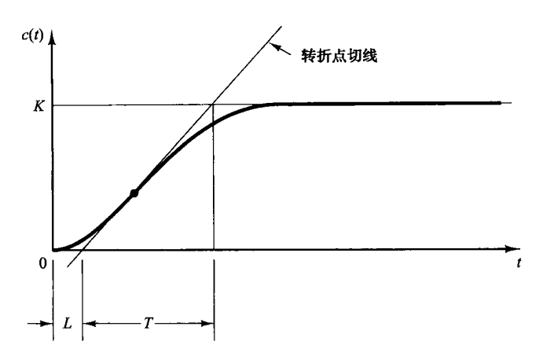

# PID

## 什么是PID

PID是比例-积分-微分控制器（Proportional-Integral-Derivative Controller）的缩写，它是一种广泛应用于工业控制系统中的反馈控制器。PID控制器通过计算控制对象的偏差（即期望值与实际值之间的差异），并根据这个偏差来调整控制信号，以达到调节控制对象的目的。

PID控制器由三个主要部分组成：

1. **比例（P）控制**：比例控制是PID控制器中最基本的部分，它直接将偏差信号乘以一个比例系数（Kp）。比例控制的特点是响应速度快，但单独使用时很难消除稳态误差。
2. **积分（I）控制**：积分控制部分对偏差信号进行积分，即累积过去的偏差值。积分控制可以消除稳态误差，提高系统的稳定性，但可能会引起系统的过度振荡。
3. **微分（D）控制**：微分控制部分对偏差信号的变化率进行控制，即预测偏差信号的未来趋势。微分控制可以减少系统的振荡，提高系统的响应速度和稳定性。

PID控制器的输出是这三个部分的加权和，即：

$u(t)=K_pe(t)+K_i\int e(t) dt+K_d\frac{\mathrm{d} e(t)}{\mathrm{d} t} $

其中：

- $u(t)$是控制器的输出。
- $e(t)$是偏差信号，即期望值与实际值之间的差。
- $K_p,K_i,K_d$分别是比例、积分和微分的系数。
- $\int e(t)dt$是偏差信号的积分。
- $\frac{\mathrm{d} e(t)}{\mathrm{d} t}$ 是偏差信号的微分。

## 参数调整

1. **比例（P）参数**：
   - **作用**：比例参数决定了控制器输出对当前误差的响应程度。比例增益越高，控制器对误差的反应越敏感，会更快地尝试减少误差。
   - **影响**：增加比例增益可以减少稳态误差，提高系统的响应速度，但过高的比例增益可能导致系统过冲增加、稳定性降低，甚至引起振荡或不稳定。
2. **积分（I）参数**：
   - **作用**：积分参数使控制器能够对过去累积的误差进行响应，从而消除稳态误差。积分项对历史误差进行累加，确保系统最终能够达到期望值。
   - **影响**：增加积分增益有助于消除稳态误差，但过高的积分增益可能导致响应速度变慢，甚至引起系统的振荡。
3. **微分（D）参数**：
   - **作用**：微分参数使控制器能够预测误差的未来趋势，从而提前做出调整。微分项对误差的变化率进行响应，有助于减少系统的超调和振荡。
   - **影响**：增加微分增益可以提高系统的稳定性和响应速度，减少超调，但过高的微分增益可能导致噪声敏感性增加，甚至引起高频振荡。

### 齐格勒-尼柯尔斯法则

- 第一种方法

先验证输入时单位阶跃响应的输出是不是S形曲线,如果不是,则这种方法不可用.在曲线的拐点处做一条切线,按照下面的图可以确实参数$K,L,T$



这样我们可以的到几个比较符合条件的PID初始参数:

| 控制器类型 | $K_p$            | $K_i$           | $K_d$  |
| ---------- | ---------------- | --------------- | ------ |
| P          | $\frac{T}{L}$    | $\infty$        | 0      |
| PI         | $0.9\frac{T}{L}$ | $\frac{L}{0.3}$ | 0      |
| PID        | $1.2\frac{T}{L}$ | $2L$            | $0.5L$ |

- 第二种方法

首先，关闭积分（$I$）和微分（$D$）作用，只保留比例（$P$）增益。逐渐增加比例增益$K_p$，直到系统在阶跃响应下进入等幅振荡（临界振荡）状态。记录此时的比例增益值$K_{cr}$和振荡周期$P_{cr}$。

| 控制器类型 | $K_p$        | $K_i$                 | $K_d$         |
| ---------- | ------------ | --------------------- | ------------- |
| P          | $0.5K_{cr}$  | $\infty$              | 0             |
| PI         | $0.45K_{cr}$ | $\frac{1}{1.2}P_{cr}$ | 0             |
| PID        | $0.6K_{cr}$  | $0.5P_{cr}$           | $0.125P_{cr}$ |

其中,$P_{cr}$是等幅的周期,$K_{cr}$是当发生等幅震荡对应的$K_p$

> 参考:[嵌入式算法开发系列之pid算法_嵌入式pid控制-CSDN博客](https://blog.csdn.net/qq_32706229/article/details/137032561)

```
参数整定寻最佳，从小到大顺次查。
先是比例后积分，最后再把微分加。
曲线震荡很频繁，比例度盘要放大。
曲线漂浮绕大弯，比例度盘往小扳。
曲线偏离回复慢，积分时间往下降。
曲线波动周期长，积分时间再加长。
理想曲线两个波，调节过程质量高。
```

## C语言代码

> 参考:[使用stm32实现电机的PID控制_stm32pid控制电机-CSDN博客](https://blog.csdn.net/weixin_43811044/article/details/127956227)

```c
typedef struct
{
	float target_val;   //目标值
	float Error;          /*第 k 次偏差 */
	float LastError;     /* Error[-1],第 k-1 次偏差 */
	float PrevError;    /* Error[-2],第 k-2 次偏差 */
	float Kp,Ki,Kd;     //比例、积分、微分系数
	float integral;     //积分值
	float output_val;   //输出值
}PID;

/**
  * @brief  PID参数初始化
  *	@note 	无
  * @retval 无
  */
void PID_param_init()
{
	PosionPID.target_val=3600;				
	PosionPID.output_val=0.0;
	PosionPID.Error=0.0;
	PosionPID.LastError=0.0;
	PosionPID.integral=0.0;
	PosionPID.Kp = 10;
	PosionPID.Ki = 0.5;
	PosionPID.Kd = 0.8;
}

/**
  * @brief  位置PID算法实现
  * @param  actual_val:实际测量值
  *	@note 	无
  * @retval 通过PID计算后的输出
  */
float PosionPID_realize(PID *pid, float actual_val)
{
	/*计算目标值与实际值的误差*/
	pid->Error = pid->target_val - actual_val;
	/*积分项*/
	pid->integral += pid->Error;
	/*PID算法实现*/
	pid->output_val = pid->Kp * pid->Error +
	                  pid->Ki * pid->integral +
	                  pid->Kd *(pid->Error -pid->LastError);
	/*误差传递*/
	pid-> LastError = pid->Error;
	/*返回当前实际值*/
	return pid->output_val;
}

/**
  * @brief  速度PID算法实现
  * @param  actual_val:实际值
  *	@note 	无
  * @retval 通过PID计算后的输出
  */
float addPID_realize(PID *pid, float actual_val)
{
	/*计算目标值与实际值的误差*/
	pid->Error = pid->target_val - actual_val;
	/*PID算法实现，照搬公式*/
	pid->output_val += pid->Kp * (pid->Error - pid-> LastError) +
	                  pid->Ki * pid->Error +
	                  pid->Kd *(pid->Error -2*pid->LastError+pid->PrevError);
	/*误差传递*/
	pid-> PrevError = pid->LastError;
	pid-> LastError = pid->Error;
	/*返回当前实际值*/
	return pid->output_val;
}
```

> 参考:[PID_C_template/PID模板.md at master · salamiGeek/PID_C_template](https://github.com/salamiGeek/PID_C_template/blob/master/PID模板.md)

```C
#define PID_INTEGRAL_ON    //位置式PID是否包含积分项。如果仅用PD控制，注释本行
 
typedef struct PID
{ 
    float P;               
    float I;
    float D;	
#ifdef 	PID_INTEGRAL_ON
    float Integral;        //位置式PID积分项
    float IntegralMax;     //位置式PID积分项最大值，用于限幅
#endif	
    float Last_Error;      //上一次误差	
    float OutputMax;       //位置式PID输出最大值，用于限幅
}PID;
 
/**********************************************************************************************************
*	函 数 名：PID_Cal
*	功能说明：位置式PID控制
*   输    入：
    NowValue:当前值
    AimValue:目标值
*   输    出：PID控制值，直接赋值给执行函数
**********************************************************************************************************/ 
float PID_Cal(PID *pid, int32_t NowValue, int32_t AimValue)
{
 
    float  iError,     //当前误差
            Output;    //控制输出	
 
    iError = AimValue - NowValue;                   //计算当前误差
	
#ifdef 	PID_INTEGRAL_ON	
    pid->Integral += pid->I * iError;	            //位置式PID积分项累加
    pid->Integral = pid->Integral > pid->IntegralMax?pid->IntegralMax:pid->Integral;  //积分项上限幅
    pid->Integral = pid->Integral <-pid->IntegralMax?-pid->IntegralMax:pid->Integral; //积分项下限幅
#endif		
	
    Output = pid->P * iError                        //比例P            
           + pid->D * (iError - pid->Last_Error);   //微分D
	
#ifdef 	PID_INTEGRAL_ON		
    Output += pid->Integral;                        //积分I
#endif	
 
    Output = Output > pid->OutputMax?pid->OutputMax:Output;  //控制输出上限幅
    Output = Output <-pid->OutputMax?-pid->OutputMax:Output; //控制输出下限幅
	
	pid->Last_Error = iError;		  	                     //更新上次误差，用于下次计算 
	return Output;	//返回控制输出值
}
```

```C
typedef struct PID
{
    float P;              //Kp系数
    float I;              //Ki系数
    float D;              //Kd系数
    float OutputMax;      //输出最大值，用于限幅
    int32_t LastError;     //前一次误差
    int32_t PrevError;     //前两次误差
} PID;
/**********************************************************************************************************
*	函 数 名：IncPIDCal
*	功能说明：增量式PID计算
*	形    参：
*	返 回 值：
******************************************************************************************************/
float IncPIDCal(PID *pid, int32_t NowValue, int32_t AimValue)
{
    int32_t iError;                          //当前误差值
    float Output;                           //控制输出增量值
    iError = AimValue - NowValue;            //目标值与当前值之差
    Output = (pid->P * iError)               //E[k]项
             - (pid->I * pid->LastError)      //E[k-1]项
             + (pid->D * pid->PrevError);     //E[k-2]项
    pid->PrevError = pid->LastError;         //存储误差，用于下次计算
    pid->LastError = iError;
    Output = Output > pid->OutputMax ? pid->OutputMax : Output; //控制输出上限幅
    Output = Output < -pid->OutputMax ? -pid->OutputMax : Output; //控制输出下限幅
    return(Output);                         //返回增量值
}
```

## MATLAB模拟程序

> 代码参考:[Matlab仿真PID控制（带M文件、simulink截图和参数分析）](https://blog.csdn.net/weixin_44044411/article/details/85891109)

### 基本PID控制原理

```matlab
ts=0.005;  %采样时间=0.005s
sys=tf(0.998,[0.021,1]);   %建立被控对象传递函数，即式4.1
dsys=c2d(sys,ts,'z');      %离散化
[num,den]=tfdata(dsys,'v');   %

e_1=0;      %前一时刻的偏差      
Ee=0;       %累积偏差
u_1=0.0;    %前一时刻的控制量
y_1=0;       %前一时刻的输出

% 初始化输出和误差向量
r=zeros(1,1000); % 期望值向量
y=zeros(1,1000); % 输出向量
e=zeros(1,1000); % 误差向量
u=zeros(1,1000); % 控制量向量

time=zeros(1,1000);%时刻点（设定1000个）

% 设置期望值
r = 1500 * ones(1,1000);

%PID参数
kp=0.22;    
ki=0.13;
kd=0;

for k=1:1:1000
    time(k)=k*ts;   %时间参数
    y(k)=-1*den(2)*y_1+num(2)*u_1+num(1)*u(k);%系统响应输出序列
    e(k)=r(k)-y(k);   %误差信号
    u(k)=kp*e(k)+ki*Ee+kd*(e(k)-e_1); %系统PID控制器输出序列
    Ee=Ee+e(k);    %误差的累加和
    u_1=u(k);    	%前一个的控制器输出值
    y_1=y(k);    	%前一个的系统响应输出值
    e_1=e(k);		%前一个误差信号的值
end

% 绘制过渡过程的曲线，x坐标限制为[0,1]
figure;
p1=plot(time,r,'-.'); hold on; % 指令信号的曲线（即期望输入）
p2=plot(time,y,'--'); % 不含积分分离的PID曲线
xlabel('Time (s)');
ylabel('Value');
legend('Reference Input', 'System Output');
xlim([0,1]);
grid on;
```

### 改进PID算法（遇限削弱积分法）

```matlab
close all
ts=0.005;  %采样时间=0.005s
sys=tf(0.998,[0.021,1]);   %建立被控对象传递函数，即式4.1
dsys=c2d(sys,ts,'z');      %离散化
[num,den]=tfdata(dsys,'v');   %
e_1=0;      %前一时刻的偏差      
Ee=0;       %累积偏差
u_1=0.0;    %前一时刻的控制量
y_1=0;       %前一时刻的输出
%PID参数
kp=0.22;    
ki=0.13;
kd=0;
u=zeros(1,1000);
time=zeros(1,1000);
for k=1:1:1000
    time(k)=k*ts;   %时间参数
    r(k)=1500;      %给定量
    y(k)=-1*den(2)*y_1+num(2)*u_1+num(1)*u(k);
    e(k)=r(k)-y(k);   %偏差
    u(k)=kp*e(k)+ki*Ee+kd*(e(k)-e_1);   
    Ee=Ee+e(k);    
    u_1=u(k);    
    y_1=y(k);    
    e_1=e(k);
end
p1=plot(time,r,'-.');xlim([0,1]);hold on;
p2=plot(time,y,'--');xlim([0,1]);
hold on;
a=1;%控制积分分离的二值数
e_1=0;Ee=0;u_1=0.0;y_1=0;%重新初始化       
for k=1:1:1000
    time(k)=k*ts;   %时间参数
    r(k)=1500;      %给定量
    y(k)=-1*den(2)*y_1+num(2)*u_1;
    e(k)=r(k)-y(k);   %偏差
    u(k)=kp*e(k)+ki*Ee+kd*(e(k)-e_1);   
     if ((u(k)>r(k)) && (e(k)>0))||((u(k)<0) && (e(k)<0))
         a=0;
     else 
         a=1;
     end     
    Ee=Ee+a*e(k);    
    u_1=u(k);    
    y_1=y(k);    
    e_1=e(k);
end
p3=plot(time,y,'-');xlim([0,1]);
title('含积分分离与不含积分分离的对比');
legend([p1,p2,p3],'指令信号','不含积分分离','含积分分离');

```

> 参考资料:
>
> **《控制工程基础》**（Fundamentals of Control Engineering）
>
> **《现代控制工程》**（Modern Control Engineering）
>
> **《PID控制器调整指南》**